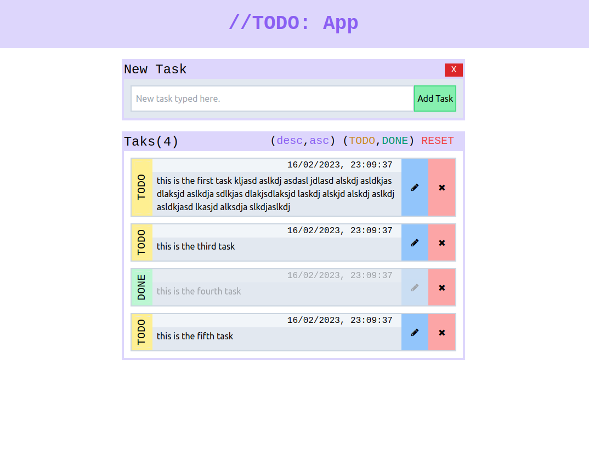

# Beginner's //TODO: web app



## Execution
Open a terminal emulator at the project's root and run:
```sh
npx tailwindcss -i ./src/input.css -o ./public/output.css --watch
```

Open another terminal emulator at the project's root and run:
```sh
npm run start
```